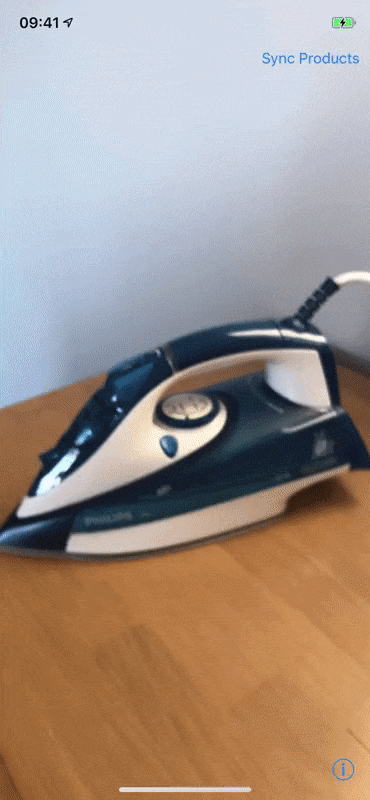
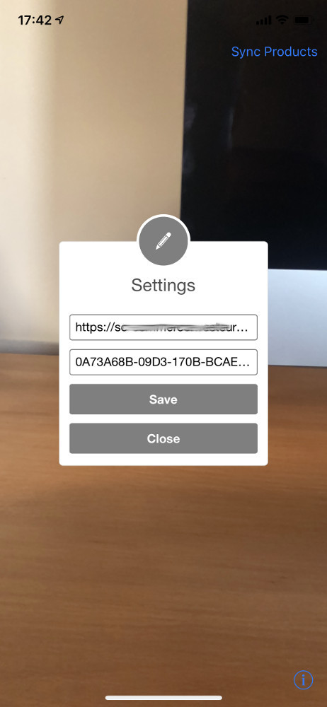
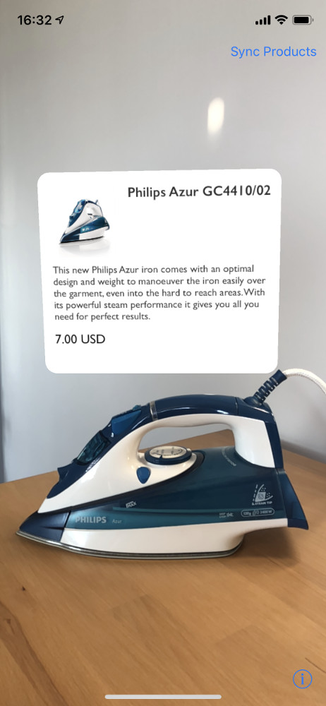

# ARCommerce.ClientApp

Client application for Sitecore Commerce [ARCommerce.ProductAPI](https://github.com/whuu/ARCommerce.ProductAPI/) built in Objective-C with [Apple ARKit](https://developer.apple.com/arkit/).

Application uses [Scanning and Detecting 3D Objects](https://developer.apple.com/documentation/arkit/scanning_and_detecting_3d_objects) technology to detect real objects. 
Object scans (`.arobject` files) used for detection are downloaded from [Sitecore Commerce](https://dev.sitecore.net/Downloads/Sitecore_Commerce.aspx) website using [ARCommerce.ProductAPI](https://github.com/whuu/ARCommerce.ProductAPI/).

## Usage

### Settings
When opened for the first time app will ask for the Sitecore Commerce URL and item ID of Products Category, which contains products with AR scans. 
Afterwards it will sync product IDs and AR objects with Sitecore. For details check `/api/cxa/ARCatalog/GetProductScans` in [ARCommerce.ProductAPI](https://github.com/whuu/ARCommerce.ProductAPI/). 
It's possible to change the settings or trigger synchronization with server afterwards, by tapping "Sync Products" or "i" buttons. 

  

### Object Scanning

When you point to the object with device's camera, app will load product information from Sitecore using `/api/cxa/ARCatalog/ProductInformation` from [ARCommerce.ProductAPI](https://github.com/whuu/ARCommerce.ProductAPI/) and display it above the object. When user taps on this information, app opens the product in Sitecore Commerce website.

  

## Installation

* In terminal call `pod install` to download dependencies.
* Install application to iOS device with xCode.
